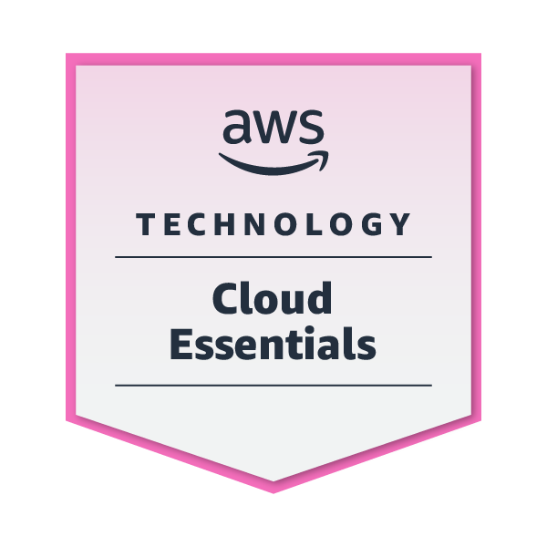
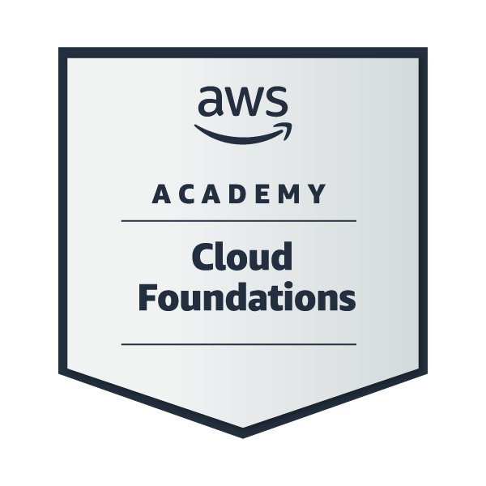
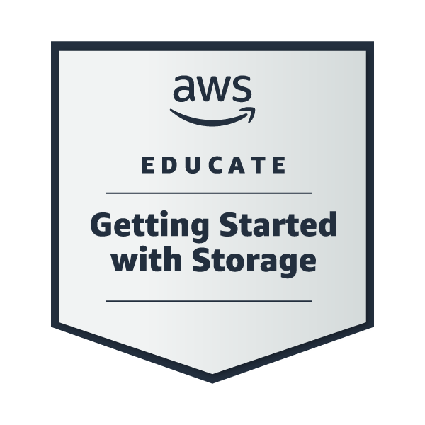
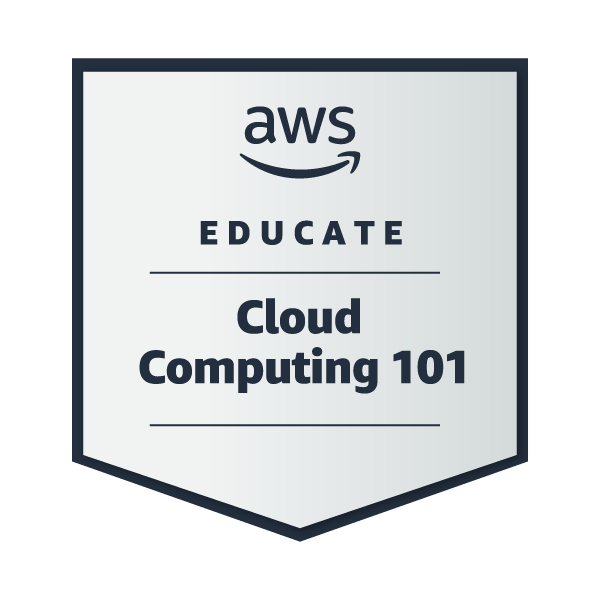
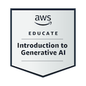
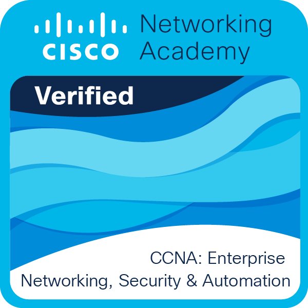
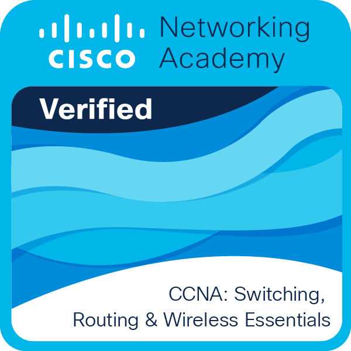
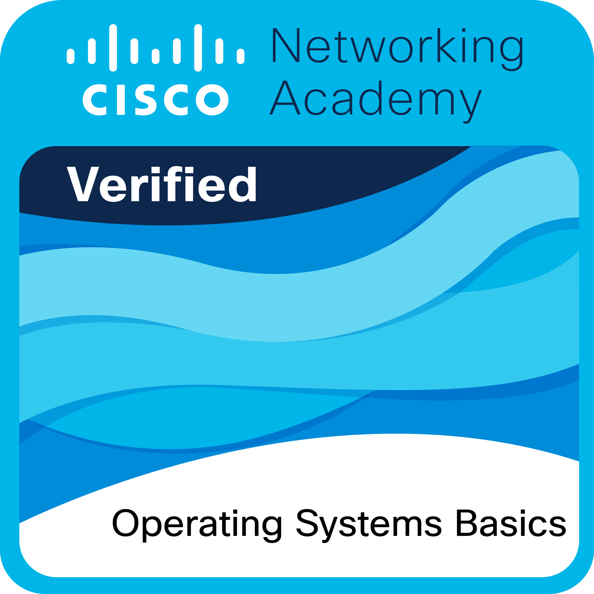

<h1 align="center">Hi 👋, I'm Nidhi Thakore</h1>
<h3 align="center">Aspiring AWS DATA ENGINEER</h3>

# 🌫 About Me:
💪 I’m currently working on Advanced Data Engineering 
🌱 I’m currently learning CI/CD Pipelines 
👯 I’m looking to collaborate on Data Engineer. 
👨‍💻 All of my projects are available at https://www.linkedin.com/in/nidhi-thakore-10b9b825b/ 
💬 Ask me about Data Engineering and AWS 
📧 How to reach me nidhithakore1125@gmail.com

# 💻 Tech Stack:

# 🌊 GitHub Stats:
 
 

# 🏆 Badges
        
