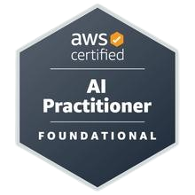
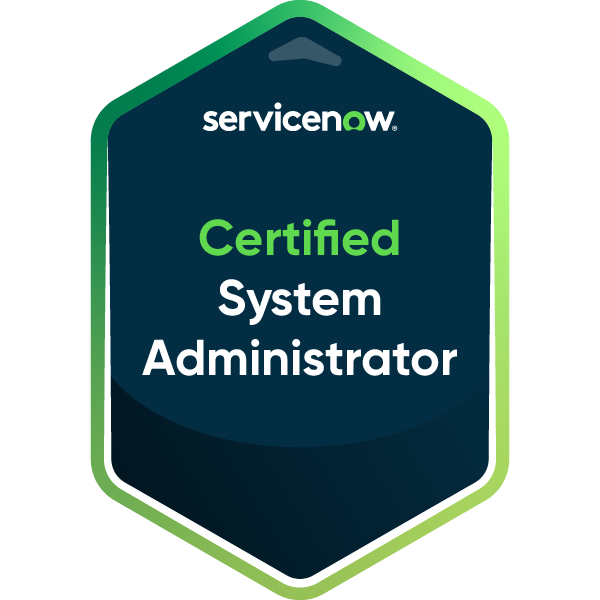
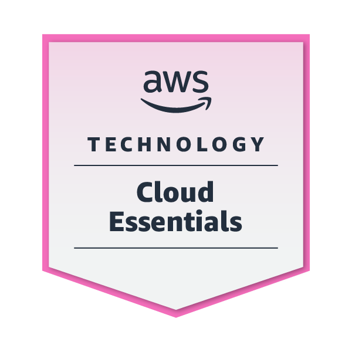
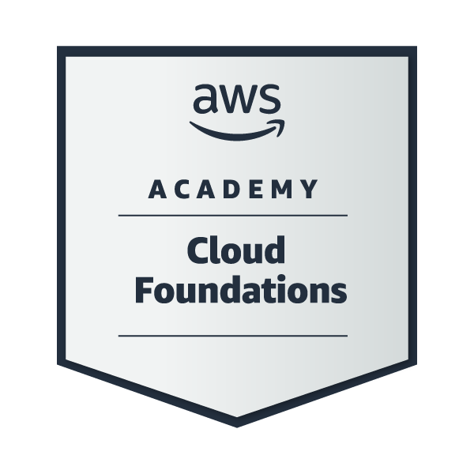
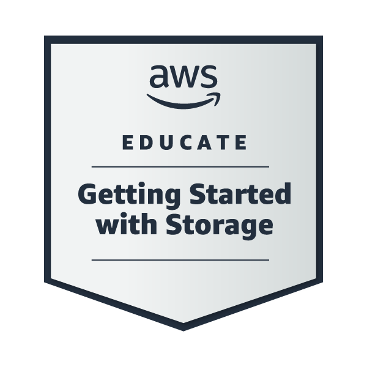
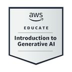

 

---

# About

Computer Science student focused on **Data Engineering, Cloud Infrastructure, and AI systems**.

- Designing **scalable data pipelines** using Spark, Kafka, and Snowflake  
- Working with **AWS and Terraform** for cloud-native architectures  
- Strong foundation in **DSA, problem solving, and system design**  
- Exploring **LLM-powered data systems and RAG pipelines**

---

# Engineering Focus

| 🧩 Data Engineering | ☁️ Cloud Engineering | 🤖 AI Systems |
|-------------------|--------------------|--------------|
| ETL Pipelines     | AWS (S3, Lambda)   | RAG Systems  |
| Spark & Kafka     | Terraform (IaC)    | NLP Basics   |
| Snowflake         | Docker             | LLM Workflows|

---

# 🛠️ Tech Stack

### 💻 Languages

  
  
  
  
  
  
  

### 🔄 Data Engineering

  
  
   
  
  
  

### ☁️ Cloud & Infrastructure

  

### 🗄️ AI/ML ,Databases & Storage

  

  
  
  
  
  

### 🛠️ Tools & Ecosystem

  

---

# 📊 GitHub Analytics

---

# 🏆 Certifications

---

# 🎯 Current Focus

- Building **production-level data pipelines**
- Learning **distributed systems & system design**
- Strengthening **cloud-native architecture skills**
- Integrating **AI into data engineering workflows**

---

# 🤝 Connect

---

⭐ *Focused on building scalable, real-world data systems*

